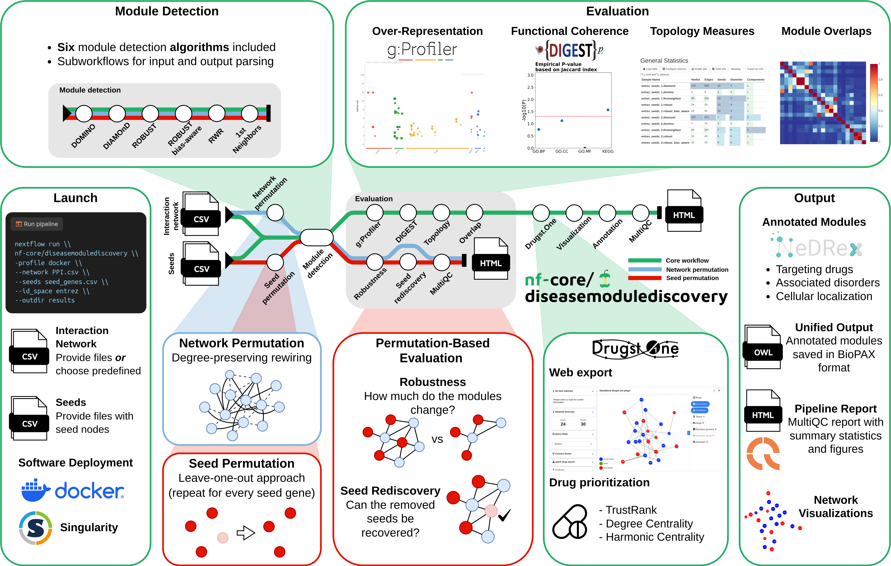

<h1>
  <picture>
    <source media="(prefers-color-scheme: dark)" srcset="docs/images/nf-core-diseasemodulediscovery_logo_dark.png">
    
  </picture>
</h1>

[](https://github.com/codespaces/new/nf-core/diseasemodulediscovery)
[](https://github.com/nf-core/diseasemodulediscovery/actions/workflows/nf-test.yml)
[](https://github.com/nf-core/diseasemodulediscovery/actions/workflows/linting.yml)[](https://nf-co.re/diseasemodulediscovery/results)[](https://doi.org/10.5281/zenodo.XXXXXXX)
[](https://www.nf-test.com)

[](https://www.nextflow.io/)
[](https://github.com/nf-core/tools/releases/tag/3.5.1)
[](https://docs.conda.io/en/latest/)
[](https://www.docker.com/)
[](https://sylabs.io/docs/)
[](https://cloud.seqera.io/launch?pipeline=https://github.com/nf-core/diseasemodulediscovery)

[](https://nfcore.slack.com/channels/diseasemodulediscovery)[](https://bsky.app/profile/nf-co.re)[](https://mstdn.science/@nf_core)[](https://www.youtube.com/c/nf-core)

## Introduction

**nf-core/diseasemodulediscovery** is a bioinformatics pipeline for network medicine hypothesis generation, designed for identifying active/disease modules. Developed and maintained by the [RePo4EU](https://repo4.eu/) consortium, it aims to characterize the molecular mechanisms of diseases by analyzing the local neighborhood of disease-associated genes or proteins (seeds) within the interactome. This approach can help identify potential drug targets for drug repurposing.



- Module inference (all enabled by default):
  - [`DOMINO`](https://github.com/Shamir-Lab/DOMINO)
  - [`DIAMOnD`](https://github.com/dinaghiassian/DIAMOnD)
  - [`ROBUST`](https://github.com/bionetslab/robust)
  - [`ROBUST (bias-aware)`](https://github.com/bionetslab/robust_bias_aware)
  - `1st Neighbors`
  - `random walk with restart (RWR)`
- Evaluation
  - Over-representation analysis ([`g:Profiler`](https://cran.r-project.org/web/packages/gprofiler2/index.html))
  - Functional coherence analysis ([`DIGEST`](https://pypi.org/project/biodigest/))
  - Network topology analysis ([`graph-tool`](https://graph-tool.skewed.de/))
  - Overlaps between different disease modules
  - Seed set perturbation-based evaluation (robustness and seed rediscovery, enabled by `--run_seed_perturbation`)
  - Network perturbation-based evaluation (robustness, enabled by `--run_network_perturbation`)
- Export to the network medicine web visualization tool [`Drugst.One`](https://drugst.one/)
- Drug prioritization using the API of [`Drugst.One`](https://drugst.one/)
- Visualization of the module networks ([`graph-tool`](https://graph-tool.skewed.de/), [`pyvis`](https://github.com/WestHealth/pyvis))
- Annotation with biological data (targeting drugs, side effects, associated disorders, cellular localization) queried from [`NeDRexDB`](https://nedrex.net/) and conversion to [`BioPAX`](https://www.biopax.org/) format.
- Result and evaluation summary ([`MultiQC`](https://seqera.io/multiqc/))

## Usage

> [!NOTE]
> If you are new to Nextflow and nf-core, please refer to [this page](https://nf-co.re/docs/usage/installation) on how to set-up Nextflow. Make sure to [test your setup](https://nf-co.re/docs/usage/introduction#how-to-run-a-pipeline) with `-profile test` before running the workflow on actual data.

> [!WARNING]
> The pipeline is still under development. In order to run it, please use the option `-r dev`

### Test your setup

```bash
nextflow run nf-core/diseasemodulediscovery \
   -profile <docker/singularity>,test \
   --outdir <OUTDIR>
```

This will run the pipeline with a small test dataset. Results will be saved to the specified `<OUTDIR>`. Use `-profile` to set whether docker or singularity should be used for software deployment.

### Running the pipeline

Now, you can run the pipeline with your own data using:

```bash
nextflow run nf-core/diseasemodulediscovery \
   -profile <docker/singularity> \
   --seeds <SEED_FILE> \
   --network <NETWORK_FILE> \
   --outdir <OUTDIR>
```

This will run the pipeline based on the provided `<SEED_FILE>` and `<NETWORK_FILE>`. Results will be saved to the specified `<OUTDIR>`. Use `-profile` to set whether docker or singularity should be used for software deployment.

> [!WARNING]
> Please provide pipeline parameters via the CLI or Nextflow `-params-file` option. Custom config files including those provided by the `-c` Nextflow option can be used to provide any configuration _**except for parameters**_; see [docs](https://nf-co.re/docs/usage/getting_started/configuration#custom-configuration-files).

For more details and further functionality, please refer to the [usage documentation](https://nf-co.re/diseasemodulediscovery/usage) and the [parameter documentation](https://nf-co.re/diseasemodulediscovery/parameters).

> [!TIP]
> **OS specifics**
> 
> The pipeline works best in combination with Linux. Furthermore, some Docker images in the pipeline are natively only available for `amd64` but not the `arm` architecture.
> Here are some tips to get the pipeline running with a different OS or architecture:
>
> **macOS**
> 
> With macOS and Apple silicon, we had better experiences using the free version of [orbstack](https://orbstack.dev/download) instead of Docker Desktop for deploying the containers.
>
>  **Windows**
>
> The most reliable solution is to work with the [Windows Subsystem for Linux (WSL)](https://documentation.ubuntu.com/wsl/latest/howto/install-ubuntu-wsl2/).
> 
> **What if it keeps failing?**
>
> Most pipeline steps are not essential. If the pipeline keeps failing because of a specific process, you may be able to just [skip](https://nf-co.re/diseasemodulediscovery/dev/docs/usage/#skipping-steps) that one.

## Pipeline output

To see the results of an example test run with a full size dataset refer to the [results](https://nf-co.re/diseasemodulediscovery/results) tab on the nf-core website pipeline page.
For more details about the output files and reports, please refer to the
[output documentation](https://nf-co.re/diseasemodulediscovery/output).

## Credits

nf-core/diseasemodulediscovery was originally written by the [RePo4EU](https://repo4.eu/) consortium.

We thank the following people for their extensive assistance in the development of this pipeline:

- [Johannes Kersting](https://github.com/JohannesKersting) (TUM)
- [Lisa Spindler](https://github.com/lspindler2509) (TUM)
- [Quirin Manz](https://github.com/quirinmanz) (TUM)
- [Quim Aguirre](https://github.com/quimaguirre) (STALICLA)
- [Chloé Bucheron](https://github.com/ChloeBubu) (University Vienna)

## Contributions and Support

If you would like to contribute to this pipeline, please see the [contributing guidelines](.github/CONTRIBUTING.md).

If you want to include an additional module identification approach, please see [this guide](docs/contributing.md).
For further information or help, don't hesitate to get in touch on the [Slack `#diseasemodulediscovery` channel](https://nfcore.slack.com/channels/diseasemodulediscovery) (you can join with [this invite](https://nf-co.re/join/slack)).

## Citations

If you use `nf-core/diseasemodulediscovery` for your analysis, please cite the preprint as follows:

> Johannes Kersting, Chloé Bucheron, Lisa M. Spindler, Joaquim Aguirre-Plans, Quirin Manz, Tanja Pock, Mo Tan, Fernando M. Delgado-Chaves, Cristian Nogales, Harald H. H. W. Schmidt, Jörg Menche, Andreas Maier, Jan Baumbach, Emre Guney, Markus List **Inferring and Evaluating Network Medicine-Based Disease Modules with Nextflow** _bioRxiv_ , 2025, [doi: 10.1101/2025.11.20.687681](https://doi.org/10.1101/2025.11.20.687681).

<!-- TODO nf-core: Add citation for pipeline after first release. Uncomment lines below and update Zenodo doi and badge at the top of this file. -->
<!-- If you use nf-core/diseasemodulediscovery for your analysis, please cite it using the following doi: [10.5281/zenodo.XXXXXX](https://doi.org/10.5281/zenodo.XXXXXX) -->

An extensive list of references for the tools used by the pipeline can be found in the [`CITATIONS.md`](CITATIONS.md) file.

You can cite the `nf-core` publication as follows:

> **The nf-core framework for community-curated bioinformatics pipelines.**
>
> Philip Ewels, Alexander Peltzer, Sven Fillinger, Harshil Patel, Johannes Alneberg, Andreas Wilm, Maxime Ulysse Garcia, Paolo Di Tommaso & Sven Nahnsen.
>
> _Nat Biotechnol._ 2020 Feb 13. doi: [10.1038/s41587-020-0439-x](https://dx.doi.org/10.1038/s41587-020-0439-x).
